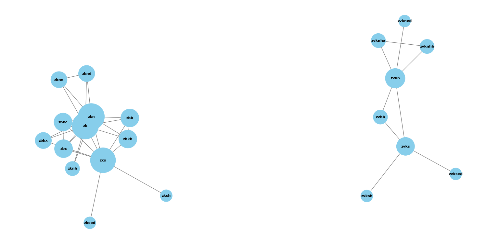

# RISC‑V Extensions Analysis

> Three tasks that gradually build from instruction counting → ISA cross‑reference → relationship graph.

---

## Project structure
├── Task-1/
│ ├── task1.py              # Parses JSON, groups instructions by extension
│ └── Task-1.md             # Report (counts, observations)
├── Task-2/
│ ├── task2.py              # Extracts extensions from ISA manual (AsciiDoc)
│ ├── riscv-isa-manual/     # Official spec (submodule or local copy)
│ └── Task-2.md             # Comparison: JSON vs manual
├── Task-3/
│ ├── graph.py              # Builds graph from shared instructions
│ ├── visual_graph.py       # Renders graph.png (main visual)
│ ├── graph.png             # Final output image
│ ├── test/
│ │ └── test_task.py        # Unit tests for graph logic
├── PROPOSAL.md             # Initial project proposal
└── README.md               # You are here


**Note:** `package.json`, `webpack.config.js`, `tailwind.config.js` are from another experiment – ignore them.

---

## What each task does

### Task 1 – Instruction landscape
- Parses `instructions.json` (dataset)
- Groups every instruction by its extension(s)
- Counts instructions per extension
- Identifies instructions that belong to multiple extensions  
→ Outputs summary in console and `Task-1.md`

### Task 2 – Cross‑reference with ISA manual
- Extracts extension names from official RISC‑V ISA manual (AsciiDoc files inside `riscv-isa-manual/`)
- Normalises names (`rv64_zba` → `zba`)
- Compares with JSON extensions  
→ Shows matches (49), only in JSON (36), only in manual (53)

### Task 3 – Extension relationship graph
- Reads same instruction data
- Builds a graph: **nodes = extensions**, **edges = shared instructions**
- Filters out isolated extensions (no shared instructions)
- Visualises with `networkx` + `matplotlib`  
→ Outputs `graph.png`

---

## Visualization



**What the graph shows:**  
- `zk` is a central hub  
- `zks` is another important bridge  
- Extensions form clusters by shared functionality  

---

## How to run

### 1. Install dependencies
```bash
pip install networkx matplotlib

2. Run each task
Task 1

bash
cd Task-1
python task1.py
Task 2 (requires riscv-isa-manual/ folder)

bash
cd ../Task-2
python task2.py
Task 3

bash
cd ../Task-3
python visual_graph.py   # or graph.py

Author
Shivam Yadav
Mumbai, India